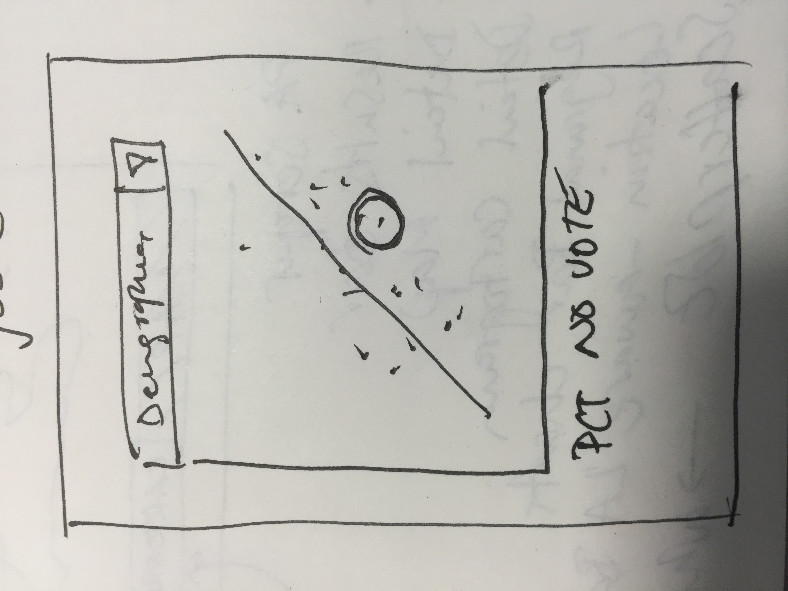

# EU Referendum results: the counting so far

A paragraph of introductory text, supplied from Bertha as Markdown, appears here to allow us to explain the current narrative and provide links to other stories being published on the night. The EU Referendum logo should appear above the heading with a link back to the in-depth page, ideally allowing users to subscribe to the the MyFT channel. 

## What is the outcome of the referendum?

This is the main element of the results page and remains stuck to the top of the page as you scroll down, so that other bars can be comapared ot the main result. After all results are known, we may want to replace this with a more stylised image, so this should be possible via a image URL specified in Bertha.

## What is included in this data?

The map serves two 

x of 382 voting areas have reported their results, accounting for about y% of the voting-age population

## How are the markets reacting?

We need to check whether we need anything beyond the currency data here, and what source we will have for intraday data.

###GBP-EUR

[Tearsheet](http://markets.ft.com/research/Markets/Tearsheets/Summary?s=EURGBP)

###GBP-USD

[Tearsheet](http://markets.ft.com/research/Markets/Tearsheets/Summary?s=USDGBP)

## What is the regional breakdown of the vote (so far)

Display the results so far, broken down by the 12 regions. All regions should display how many of their constituent voting areas' results are known so far. The image below suggests a drilldown is possible, but that may be unnecessary overkill. The default order should be alphabetical, but it should also be possible to sort by Yes/No count or percentage.

## What are the most recently-added results?

During the count, this section shows the x most recently-added local results, where x is controllable from Bertha. When x or fewer areas remain, the remaining areas are all displayed, with the unreported areas greyed out. This will allow us to highlight contested or uncertain areas if this occurs. This section will disappear when all areas are accounted for.

## How has *my area* voted?

This attempts to detect the user's location and display the result in their local voting area.

* If an area with no data is detected, display an error message saying that the result for this area is not yet known
* If an area with data is detected, display its bar chart and a prompt to tweet the result
* If a non-UK location is detected, default to an interesting area specified in Bertha or, if none is specified, the most recently-reported result.

In all cases, we provide a mechanism for selecting another area:

## Who voted this way

Nice-to-have section to compare the percentage 'no' vote to various social and demographic factors as a scatterplot.

## Related stories

A panel of other Brexit stories, ideally drawn from the same Methode list that controls the home page panel. This can allow this page to serve as an entry point to FT coverage in case it outperforms the liveblog or other content generated on the night.

## Credits
Source: Press Association, Bloomberg, Thomson Reuters Datastream, FT Research
Get the [code for this page](https://github.com/ft-interactive/eu-referendum-results/) on Github.