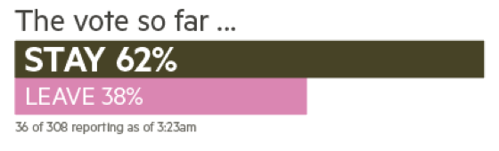
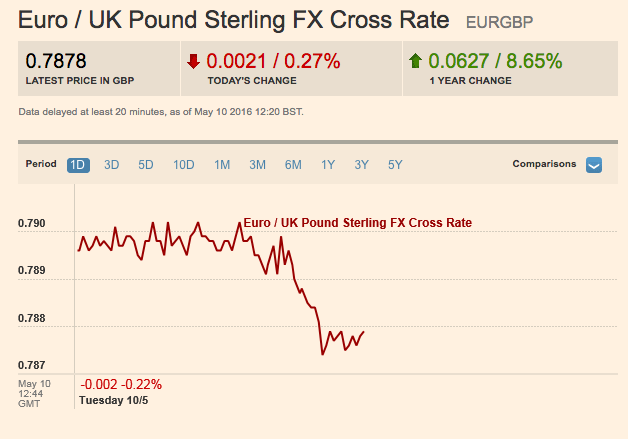
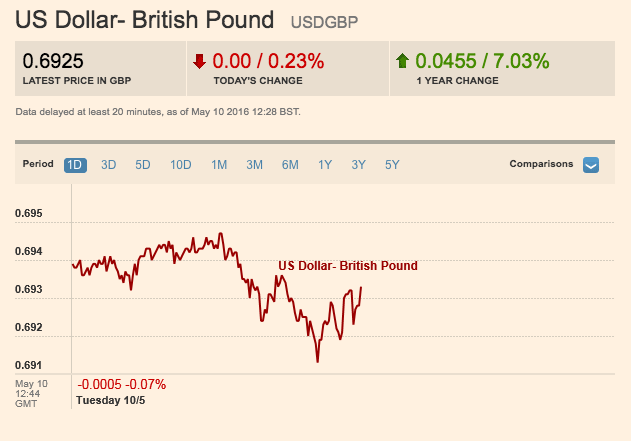
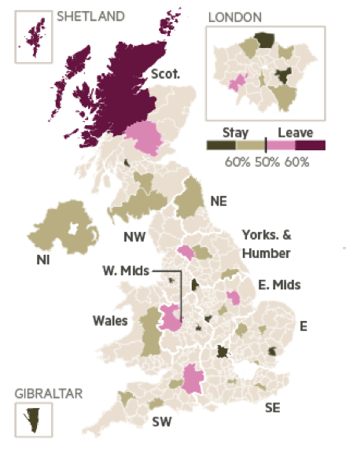
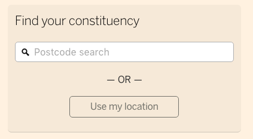

# EU Referendum results: the counting so far

## What is the outcome of the referendum?

Big number: XX% vote [Remain/Leave]

## How are the markets reacting?

###GBP-EUR

[Tearsheet](http://markets.ft.com/research/Markets/Tearsheets/Summary?s=EURGBP)

###GBP-USD

[Tearsheet](http://markets.ft.com/research/Markets/Tearsheets/Summary?s=USDGBP)

## What is included in this data?

x of 382 voting areas have reported their results, accounting for about y% of the voting-age population

## What is the regional breakdown of the vote (so far)

## What are the most recently-added results?

During the count, this section shows the x most recently-added local results, where x is controllable from Bertha. When x or fewer areas remain, the remaining areas are all displayed, with the unreported areas greyed out. This will allow us to highlight contested or uncertain areas if this occurs. This section will disappear when all areas are accounted for.

## How has my area voted?

(If the data is unavailable)
The result for the voting area you are in, [[Southwark]], has not yet been announced area's result has not yet been announced.
(else)

(endif)

Or chose another area: 

